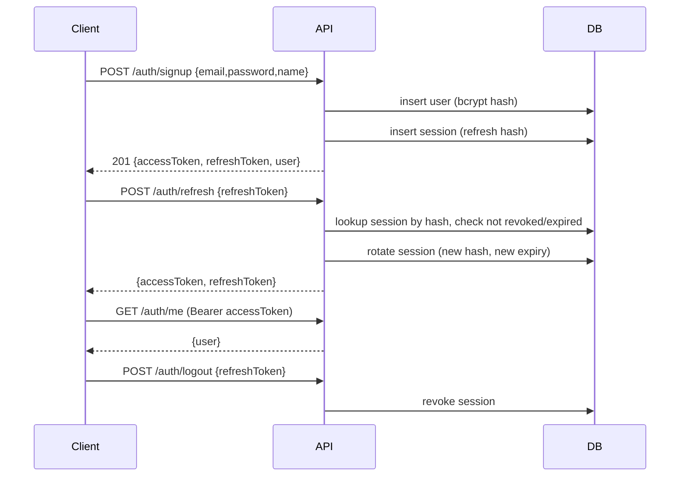

# MoneyOS — Architecture

- Status: Draft v0.1
- Date: 2026-08-13

## 1. Stack

| Concern | Choice | Notes |
| --- | --- | --- |
| Language | TypeScript (strict) | Node 22+, ESM |
| Runtime | Node.js >= 22 | |
| HTTP framework | Fastify 5 | schema-based, fast, plugin ecosystem |
| ORM | Drizzle ORM 0.45 | type-safe, SQL-first migrations via drizzle-kit |
| Database | SQLite (`better-sqlite3`) | relational, zero-setup, portable schema to Postgres later |
| Validation | Zod 4 | at the API boundary and for env config |
| Auth | JWT (access, `jose`) + rotating refresh tokens (hashed in DB) | provider-extensible |
| Passwords | bcryptjs | pure JS, no native build step |
| Security headers | @fastify/helmet | |
| CORS | @fastify/cors | allow-list from env |
| Rate limiting | @fastify/rate-limit | strict on auth endpoints |
| Tests | Vitest 4 | unit + integration via `app.inject()` |
| Lint / Format | ESLint 9 (typescript-eslint) / Prettier | |
| Build | `tsc` (tsconfig.build.json) | dev via `tsx` |

### Why these choices

- **Money correctness**: amounts are stored as integer minor units; API accepts decimal
  strings, never floats.
- **Local-first**: SQLite gives instant, portable development and testing. The Drizzle
  schema stays portable so a Postgres deployment is a config + migration change, not a
  rewrite.
- **Modularity**: domain modules under `src/modules/` are self-contained (routes, service,
  schema). A module can be added without touching others.

## 2. Repository Layout

```
moneyos/
├── docs/                     # PRD, ARCHITECTURE, DATABASE, ROADMAP
├── drizzle/                  # generated SQL migrations (git-committed)
├── data/                     # local SQLite files (git-ignored)
├── web/                      # React + Vite SPA (frontend, see §12)
├── src/
│   ├── server.ts             # entrypoint: env → db → migrate → app → listen
│   ├── app.ts                # buildApp({ db, logger }) → Fastify instance
│   ├── config/
│   │   └── env.ts            # zod-validated environment
│   ├── db/
│   │   ├── schema.ts         # drizzle schema (single source of truth)
│   │   ├── client.ts         # better-sqlite3 + drizzle client factory
│   │   └── migrate.ts        # programmatic migration runner
│   ├── lib/
│   │   ├── errors.ts         # AppError + Fastify error handler
│   │   ├── money.ts          # minor-unit parsing/formatting, arithmetic
│   │   ├── ledger.ts         # reusable money/balance/totals queries (dashboard, budgets)
│   │   ├── dates.ts          # date-only (`YYYY-MM-DD`) and month (`YYYY-MM`) helpers
│   │   ├── auth/
│   │   │   ├── password.ts   # bcrypt hash/verify
│   │   │   ├── tokens.ts     # JWT sign/verify, refresh token hash/verify
│   │   │   ├── authenticate.ts # Fastify preHandler plugin
│   │   │   └── mailer.ts     # Mailer interface + console (dev) implementation
│   │   └── crypto.ts         # random token generation, sha256 (node:crypto)
│   └── modules/
│       ├── health/           # GET /health (public)
│       ├── auth/             # signup, login, refresh, logout, reset, profile
│       ├── accounts/         # account CRUD + balance management
│       ├── categories/       # category CRUD + hierarchy
│       ├── transactions/     # income/expense CRUD + reversal
│       ├── transfers/        # transfers as linked legs + reversal
│       ├── dashboard/        # GET /dashboard (overview)
│       ├── budgets/          # budget CRUD + live spending/status
│       └── savings/          # savings goals CRUD + contributions + estimates
└── test/
    ├── money.test.ts
    ├── auth.integration.test.ts
    ├── financial.helpers.ts
    ├── dashboard.integration.test.ts
    ├── budgets.integration.test.ts
    └── savings.integration.test.ts
```

## 3. Module Pattern

Each domain module follows the same shape:

```
src/modules/<domain>/
├── <domain>.schema.ts    # zod schemas (request/response)
├── <domain>.service.ts   # pure-ish business logic; takes db as input
├── <domain>.routes.ts    # Fastify plugin registering routes
└── <domain>.types.ts     # shared types
```

- Routes are thin: parse + validate → call service → serialize.
- Services are constructed with `db` and `config` (constructor injection) for testability.
- `app.ts` wires modules together; `server.ts` is the only file that touches the process.

## 4. HTTP / API Conventions

- JSON everywhere. Consistent error shape:

```json
{
  "error": { "code": "VALIDATION_ERROR", "message": "...", "details": [...] }
}
```

- Auth: `Authorization: Bearer <access_token>`.
- Ownership: derived from the authenticated token (`request.user.id`). Client-sent
  `userId` is never trusted.
- Monetary fields in requests/responses are decimal **strings** (e.g. `"1500.50"`),
  stored as integer minor units.
- Future list endpoints: consistent `?page=&limit=`, filtering, sorting, and
  `{ data: [], meta: { page, limit, total } }` envelope.
- Date conventions: date-only values are `YYYY-MM-DD` strings; timestamps are ISO 8601.

## 5. Authentication Architecture

- **Access token**: signed JWT (`jose`), short-lived (default 15 min), claims
  `{ sub: userId, iat, exp, iss, aud }`. Stateless verification in a Fastify preHandler.
- **Refresh token**: cryptographically random 256-bit value; only its SHA-256 hash is
  stored in `auth_sessions`. Rotation on every refresh; the old session row is updated.
- **Session lifecycle**: one `auth_sessions` row per issued refresh token (multi-device).
  Logout revokes the presented session. Password reset revokes all sessions.
- **Password reset**: token hash + expiry stored in `password_reset_tokens`; delivery via
  the `Mailer` interface (console/dev implementation logs the link; a real provider plugs in later).
- **CSRF**: not applicable (no cookie-based auth; tokens travel in the Authorization header).
- **Extensibility**: auth logic lives behind services and a preHandler hook so an OAuth
  provider can be added later without rewriting routes.

### Auth flow (Mermaid)



## 6. Money Model

- Storage: integer **minor units** (`amountMinor`, e.g. EGP 1500.50 → `150050`).
- Currency: ISO 4217 text code stored on every money-bearing row; never assumed globally.
- API boundary: `parseAmountToMinor("1500.50")` → `150050` (string-based, no float);
  `formatMinorToAmount(150050)` → `"1500.50"`.
- Rounding: only at conversion time, using integer math (half-up via integer division).
- Currency digits are looked up (EGP/USD/EUR/GBP → 2, KWD → 3, JPY → 0) with a safe default.
- Currency conversion, when added later, is a separate service; **never silent**.

See `docs/DATABASE.md` for the schema mapping.

## 7. Error Handling

- Domain errors are `AppError(status, code, message)` — mapped by a global error handler to
  the error envelope.
- Validation errors are produced by Fastify schema serialization and normalized to
  `VALIDATION_ERROR`.
- Unexpected errors: logged server-side (with request id), returned as a generic
  `INTERNAL_ERROR` without stack traces.
- 404s and 401/403 carry minimal, safe messages.

## 8. Configuration

All configuration comes from environment variables, parsed and validated by Zod in
`src/config/env.ts` at boot. Invalid config fails fast with a readable error.
Secrets (`JWT_SECRET`) are never logged or committed. `.env.example` documents every var.

## 9. API Surface (implemented)

All routes below require `Authorization: Bearer <access_token>` unless noted.

| Method | Path | Notes |
| --- | --- | --- |
| GET | `/health` | public |
| POST | `/auth/signup`, `/auth/login`, `/auth/refresh`, `/auth/logout`, `/auth/forgot-password`, `/auth/reset-password` | public (logout/refresh take refresh token) |
| GET/PATCH | `/auth/me` | profile |
| GET/POST | `/accounts`; GET/PATCH `/accounts/:id`; POST `/accounts/:id/archive`/`activate` | |
| GET/POST | `/categories`; PATCH `/categories/:id`; POST `/categories/:id/archive` | |
| GET/POST | `/transactions`; GET `/transactions/:id`; POST `/transactions/:id/reverse` | |
| GET/POST | `/transfers`; POST `/transfers/:id/reverse` | |
| GET | `/dashboard?month=YYYY-MM&currency=` | overview; month summary/trend in one currency |
| GET/POST | `/budgets`; GET/PATCH `/budgets/:id`; POST `/budgets/:id/archive` | `?period=&includeArchived=` |
| GET/POST | `/savings-goals`; GET/PATCH `/savings-goals/:id`; POST `/savings-goals/:id/archive`; GET/POST `/savings-goals/:id/contributions` | |

Monetary fields are decimal strings over the API and integer minor units in storage.

## 10. Testing Strategy

- **Unit tests** (`test/money.test.ts`, …): pure business logic — money conversion,
  savings-rate edge cases, token hashing.
- **Integration tests** (`test/*.integration.test.ts`): spin up `buildApp()` against an
  in-memory SQLite DB with migrations applied, then drive the API with `app.inject()`.
  Cover auth, accounts, transactions, transfers, dashboard, budgets, savings goals,
  including user isolation (cross-user access → 404/401).
- Every major financial calculation (income totals, expenses, transfers, balances,
  budgets, savings progress/rate, net worth, category aggregation, currency) has tests.

## 11. Security Checklist

- [x] Passwords hashed with bcrypt (never plain text).
- [x] Access JWT signed; refresh tokens stored hashed (SHA-256), rotated on use.
- [x] Rate limiting on auth endpoints; global limiter on the API.
- [x] Security headers via helmet; CORS allow-list from env.
- [x] Input validation at API boundary (Zod/Fastify).
- [x] User ownership enforced in queries; no client-supplied identity.
- [x] No secrets in source; env-based config; `.env` git-ignored.
- [ ] (Later) Postgres deployment hardening, backups, audit log of sensitive ops.

## 12. Extensibility Plan

| Future module | Interface prepared |
| --- | --- |
| Investments | account type `investment` reserved; money model + provider abstraction noted |
| Projects | ownership + money model reusable |
| Charity | ownership + money model reusable |
| AI insights | analytics services stay UI-free; insights layer reads analytics output |
| Currency conversion | separate `rates` service; never implicit |
| Alternative auth | preHandler + service boundary allows OAuth later |

## 13. Frontend (`web/`)

React 18 + Vite 5 + react-router-dom + TypeScript (strict), no component/chart library
beyond the stack — layout and simple CSS/SVG charts are hand-rolled. Mobile-first with a
bottom navigation on small screens.

- **API client** (`web/src/lib/api.ts`): typed fetch wrapper. Uses a Vite dev proxy so the
  browser only ever calls same-origin `/api/*` (rewritten to the Fastify server on port
  3001), avoiding CORS entirely. Errors are normalized to `ApiError`.
- **Auth** (`web/src/lib/auth.tsx`): `AuthProvider` context holding the current user;
  access/refresh tokens in `localStorage`. Pages redirect to `/login` when unauthenticated.
- **Pages**: `/` dashboard, `/budgets`, `/savings`, `/accounts`, `/transactions`,
  `/transfers`, plus `/login` and `/signup`.
- **Financial correctness boundary**: all money math lives in the backend. The frontend
  only formats values the API already computed (minor units → decimal strings) and scales
  chart bars for display; it never re-computes totals, rates, or percentages.
- **Currency handling**: the dashboard shows one user-selected currency for aggregates and
  lists per-currency balances separately; the UI never sums across currencies.
