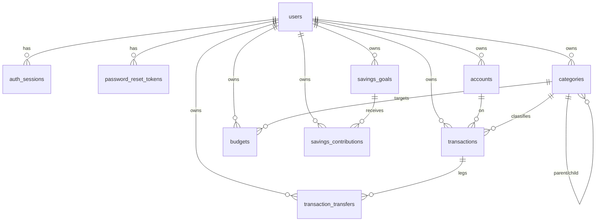

# MoneyOS — Database Design

- Status: Draft v0.1
- Date: 2026-08-13
- ORM: Drizzle ORM (schema in `src/db/schema.ts`, migrations in `drizzle/`)
- Dialect: SQLite (`better-sqlite3`) for dev/test; schema kept portable to Postgres

## 1. Conventions

- **IDs**: `TEXT` — 27-char cuid2-style random ids (URL-safe, collision-resistant).
- **Money**: stored as **integer minor units** (`*Minor`) with an explicit ISO 4217
  `currency` TEXT column on every money-bearing row. No floats, ever.
- **Timestamps**: stored as integer epoch **milliseconds** (SQLite), exposed as ISO 8601
  by the API.
- **Ownership**: every user-owned table has a `userId` column referencing `users.id`,
  and every query is scoped by the authenticated user. No cross-user reads possible.
- **Foreign keys**: enabled per connection via `PRAGMA foreign_keys = ON`.
- **Soft deletes**: accounts/categories use `isActive`/`isArchived` flags; transaction
  history is immutable (no deletes on financial records).

## 2. Entity-Relationship Overview



## 3. Tables

### 3.1 `users`

| Column | Type | Notes |
| --- | --- | --- |
| id | TEXT PK | |
| email | TEXT UNIQUE NOT NULL | normalized lowercase; CITEXT-like via app logic |
| name | TEXT NOT NULL | display name |
| passwordHash | TEXT NOT NULL | bcrypt |
| defaultCurrency | TEXT NOT NULL | ISO 4217, default from env |
| locale | TEXT NOT NULL | default `en` |
| isActive | INTEGER NOT NULL | 1/0, disable account |
| emailVerifiedAt | INTEGER NULL | epoch ms; reserved for verification |
| createdAt / updatedAt | INTEGER NOT NULL | epoch ms |

### 3.2 `auth_sessions`

One row per issued (rotated) refresh token — enables multi-device + revocation.

| Column | Type | Notes |
| --- | --- | --- |
| id | TEXT PK | |
| userId | TEXT FK → users.id | indexed |
| tokenHash | TEXT UNIQUE NOT NULL | SHA-256 of refresh token |
| userAgent | TEXT NULL | device metadata (non-sensitive) |
| ipAddress | TEXT NULL | connection metadata |
| expiresAt | INTEGER NOT NULL | epoch ms |
| revokedAt | INTEGER NULL | epoch ms when logged out |
| lastUsedAt | INTEGER NULL | |
| createdAt | INTEGER NOT NULL | |

### 3.3 `password_reset_tokens`

| Column | Type | Notes |
| --- | --- | --- |
| id | TEXT PK | |
| userId | TEXT FK → users.id | |
| tokenHash | TEXT NOT NULL | SHA-256 of reset token |
| expiresAt | INTEGER NOT NULL | |
| usedAt | INTEGER NULL | one-time use |
| createdAt | INTEGER NOT NULL | |

### 3.4 `accounts`

| Column | Type | Notes |
| --- | --- | --- |
| id | TEXT PK | |
| userId | TEXT FK → users.id | indexed |
| name | TEXT NOT NULL | |
| type | TEXT NOT NULL | `cash \| bank \| mobile_wallet \| credit_card \| savings \| investment \| other` (extensible list, not hard-coded logic) |
| currency | TEXT NOT NULL | ISO 4217 |
| openingBalanceMinor | INTEGER NOT NULL | default 0 |
| currentBalanceMinor | INTEGER NOT NULL | derived/updated with transactions |
| note | TEXT NULL | |
| isActive | INTEGER NOT NULL default 1 | soft delete |
| createdAt / updatedAt | INTEGER NOT NULL | |

### 3.5 `categories`

| Column | Type | Notes |
| --- | --- | --- |
| id | TEXT PK | |
| userId | TEXT FK → users.id | indexed |
| parentId | TEXT NULL FK → categories.id | hierarchy; NULL = root |
| name | TEXT NOT NULL | |
| type | TEXT NOT NULL | `income \| expense \| both` |
| icon | TEXT NULL | optional emoji/icon key |
| isArchived | INTEGER NOT NULL default 0 | soft delete |
| createdAt / updatedAt | INTEGER NOT NULL | |

Default categories (Food/Restaurants/Groceries, Transport/Fuel/Taxi, Bills/…, etc.) are
**seed data** in a later phase — never hard-coded in application logic.

### 3.6 `transactions`

The core financial event. **Immutable** — edits/corrections are explicit (reversal or
adjustment rows), never silent mutation.

| Column | Type | Notes |
| --- | --- | --- |
| id | TEXT PK | |
| userId | TEXT FK → users.id | indexed |
| accountId | TEXT FK → accounts.id | indexed |
| type | TEXT NOT NULL | `income \| expense \| transfer` |
| amountMinor | INTEGER NOT NULL | signed: +income, −expense/transfer-out |
| currency | TEXT NOT NULL | |
| categoryId | TEXT NULL FK → categories.id | |
| description | TEXT NULL | |
| notes | TEXT NULL | |
| date | TEXT NOT NULL | `YYYY-MM-DD` (user-facing date) |
| transferId | TEXT NULL FK → transaction_transfers.id | set when type = transfer |
| createdAt / updatedAt | INTEGER NOT NULL | |

Indexes: `(userId, date)`, `(userId, accountId)`, `(userId, categoryId)`.

### 3.7 `transaction_transfers`

Links the two legs of a transfer so a transfer is **never** treated as income/expense.

| Column | Type | Notes |
| --- | --- | --- |
| id | TEXT PK | |
| userId | TEXT FK → users.id | |
| fromTransactionId | TEXT NOT NULL FK → transactions.id | leg on source account (negative) |
| toTransactionId | TEXT NOT NULL FK → transactions.id | leg on destination account (positive) |
| fromAccountId | TEXT FK → accounts.id | |
| toAccountId | TEXT FK → accounts.id | |
| amountMinor | INTEGER NOT NULL | positive magnitude |
| currency | TEXT NOT NULL | |
| notes | TEXT NULL | |
| createdAt | INTEGER NOT NULL | |

Net effect over both legs: **0** — dashboards/savings exclude transfers automatically.

### 3.8 `budgets`

| Column | Type | Notes |
| --- | --- | --- |
| id | TEXT PK | |
| userId | TEXT FK → users.id | indexed |
| categoryId | TEXT FK → categories.id | indexed |
| period | TEXT NOT NULL | `YYYY-MM` |
| amountMinor | INTEGER NOT NULL | monthly limit |
| currency | TEXT NOT NULL | ISO 4217 |
| spentMinor | INTEGER NOT NULL default 0 | cached; spending is derived live from transactions |
| warningThresholdPercent | INTEGER NOT NULL default 80 | configurable per budget (0–100) |
| isArchived | INTEGER NOT NULL default 0 | soft delete |
| createdAt / updatedAt | INTEGER NOT NULL | |

UNIQUE `(userId, categoryId, period)` + index `(userId, period)`.

### 3.9 `savings_goals`

| Column | Type | Notes |
| --- | --- | --- |
| id | TEXT PK | |
| userId | TEXT FK → users.id | indexed |
| name | TEXT NOT NULL | e.g. "Emergency Fund" |
| targetMinor | INTEGER NOT NULL | > 0 |
| currentMinor | INTEGER NOT NULL default 0 | maintained transactionally with contributions |
| currency | TEXT NOT NULL | |
| targetDate | TEXT NULL | `YYYY-MM-DD` |
| description | TEXT NULL | optional |
| isArchived | INTEGER NOT NULL default 0 | |
| createdAt / updatedAt | INTEGER NOT NULL | |

### 3.10 `savings_contributions`

One row per contribution; `currentMinor` on the goal equals the sum of its
contributions (kept consistent inside a transaction).

| Column | Type | Notes |
| --- | --- | --- |
| id | TEXT PK | |
| userId | TEXT FK → users.id | indexed |
| savingsGoalId | TEXT FK → savings_goals.id | indexed |
| amountMinor | INTEGER NOT NULL | > 0 |
| currency | TEXT NOT NULL | |
| note | TEXT NULL | |
| createdAt | INTEGER NOT NULL | |

## 4. Reserved for Future Modules

Tables below are **designed for later phases** (not implemented in the first migration):

- `investments`, `investment_transactions` — quantities, average cost, market value,
  realized/unrealized P&L; market data behind provider interfaces.
- `projects`, `project_transactions` — revenue, costs, profit, margin.
- `donations` — amount, date, purpose, recipient, notes; monthly/yearly aggregates.
- `notifications` — budget warnings, goal milestones.
- `financial_snapshots` — point-in-time net worth / balance history for trend charts.

Each will carry `userId` ownership and reuse the money model.

## 5. Migration Workflow

```bash
npm run db:generate   # drizzle-kit generates SQL from schema.ts → drizzle/
npm run db:migrate    # applies migrations (also runs automatically before dev)
```

Applied migrations: `0000` (core schema), `0001` (nullable transfer-leg links),
`0002` (budgets `isArchived`, savings `description`, `savings_contributions`),
`0003` (budgets `currency`).

SQLite foreign keys are enforced per connection (`PRAGMA foreign_keys = ON` in
`src/db/client.ts`). Migrations are committed to source control.

## 6. Integrity Rules Enforced

- `amountMinor` ≠ 0 for non-transfer transactions.
- Income/expense require a valid `categoryId` (nullable only for transfers).
- Transfer requires both legs and both accounts; net = 0.
- Budget `amountMinor > 0`; savings target `> 0`; contribution `> 0`.
- Savings goal `currentMinor` = sum of its contributions (transactional).
- Goal currency cannot change once contributions exist (no silent conversion).
- All writes scoped by `userId`; foreign keys on; unique email.
